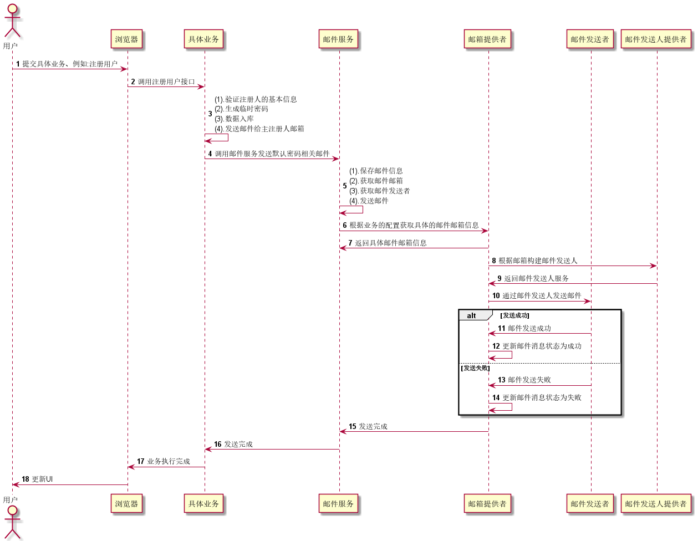

## 邮箱模块

    邮箱模块，主要功能是发送邮件的作用。此模块的调用逻辑和存储模块类似
    目前，邮箱模块的邮箱信息，只能进行是系统预设的部分。只能对此部分进行修改
    不过可对此进行扩展。自定义实现EmailMailboxProvider 接口。
    
### 类介绍
    1. EmailMailboxService 邮件邮箱服务，管理可以使用的邮箱
    2. EmailMessaheService 邮件消息服务。管理通过邮箱发送的邮件信息的状态、目标邮箱等等
    3. EmailMessageContentService 邮件消息内容服务，实现存储邮件内容的管理功能额
    4. MailboxService 邮箱服务，实现具体发送邮件的功能， 外部调用的方法
    5. EmailMailboxProvider 邮件邮箱服务提供者接口
    6. EmailMessageSenderProvider 邮件消息发送人提供者接口

### 入口
    1. MailboxService 调用邮件服务

### 调用

