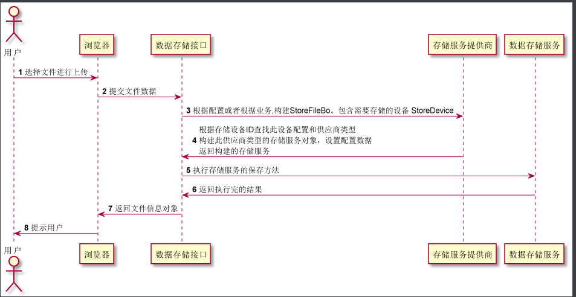

[menu]
# 存储服务
    存储服务、用于保存文件信息。存储文件的数据和存储的文件信息是分开独立的

### 存储文件数据服务
 1. StorageService              存储文件数据的服务
 2. StorageServiceProvider      根据设备枚举创建存储服务 StorageService
 3. StoreDeviceService          存储文件数据设备信息服务
 4. StoreFileService            存储文件信息服务。注意: 和存储文件数据服务是不一样的
 5. StoreFileAttributeService   存储文件属性信息服务  
---
    1. 文件数据存储服务和文件信息存储服务是并存的服务。
    2. 客户端调用文件数据存储服务。文件数据存储存储服存储完之后，会返回一些基础的文件信息数据对象 StoreFileResultDto
    3. 客户端得到文件数据存储服务响应的数据后，会携带数据提交到具体的业务服务接口中，在具体的业务服务中调用文件信息服务进行保存文件信息

### 执行流程

### 存储设备/存储设备供应商
    
    存储设备： 存储的容器，例如: 阿里云OSS 北京、阿里云OSS 上海、本地存储
    存储设备供应商: 阿里云，本地存储，腾讯云

### 数据存储执行流程

